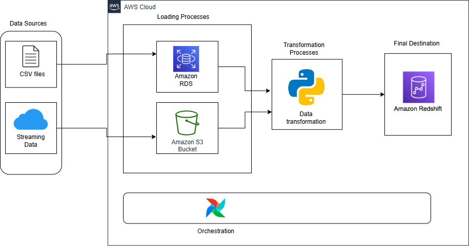

Overview
========

# Batch Data Processing Using Airflow, S3 & Redshift

This project demonstrates how to use Apache Airflow to orchestrate an ETL pipeline that extracts data from an S3 bucket, transforms it, and loads it into a Redshift table. This project fetches batch data containing user and song metadata that reside in an Amazon RDS database and a streaming data stored in Amazon S3 in batch files. This pipeline extract, validate, transform and load the data into Amazon Redshift for analytical processing.

    

# Goals of this Project

Project Contents
================

This Astro project contains the following files and folders:

- dags: This folder contains the Python files for your Airflow DAGs. 
  - `new_dag.py`: A new DAG created to extract data from an S3 bucket, transform it, and load it into a Redshift table.
  - `new_dag_v1.py`: An update of the `new_dag.py`, with the required KPI calculated and this DAG creates a new Redshift table called kpis.
- Dockerfile: This file contains a versioned Astro Runtime Docker image that provides a differentiated Airflow experience. If you want to execute other commands or overrides at runtime, specify them here.
- include: This folder contains any additional files that you want to include as part of your project. It is empty by default.
- packages.txt: Install OS-level packages needed for your project by adding them to this file.
- requirements.txt: Install Python packages needed for your project by adding them to this file.
- plugins: Add custom or community plugins for your project to this file. It is empty by default.
- airflow_settings.yaml: Use this local-only file to specify Airflow Connections, Variables, and Pools instead of entering them in the Airflow UI as you develop DAGs in this project.

Deploy Your Project Locally
===========================

1. Start Airflow on your local machine by running 'astro dev start'.

This command will spin up 4 Docker containers on your machine, each for a different Airflow component:

- Postgres: Airflow's Metadata Database
- Webserver: The Airflow component responsible for rendering the Airflow UI
- Scheduler: The Airflow component responsible for monitoring and triggering tasks
- Triggerer: The Airflow component responsible for triggering deferred tasks

2. Verify that all 4 Docker containers were created by running 'docker ps'.

Note: Running 'astro dev start' will start your project with the Airflow Webserver exposed at port 8080 and Postgres exposed at port 5432. If you already have either of those ports allocated, you can either [stop your existing Docker containers or change the port](https://www.astronomer.io/docs/astro/cli/troubleshoot-locally#ports-are-not-available-for-my-local-airflow-webserver).

3. Access the Airflow UI for your local Airflow project. To do so, go to http://localhost:8080/ and log in with 'admin' for both your Username and Password.

You should also be able to access your Postgres Database at 'localhost:5432/postgres'.

Deploy Your Project to Astronomer
=================================

If you have an Astronomer account, pushing code to a Deployment on Astronomer is simple. For deploying instructions, refer to Astronomer documentation: https://www.astronomer.io/docs/astro/deploy-code/

Contact
=======

The Astronomer CLI is maintained with love by the Astronomer team. To report a bug or suggest a change, reach out to our support.
